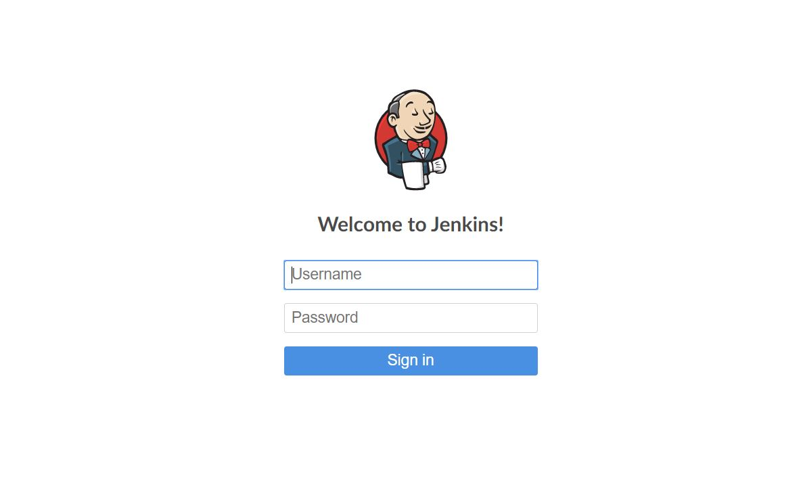
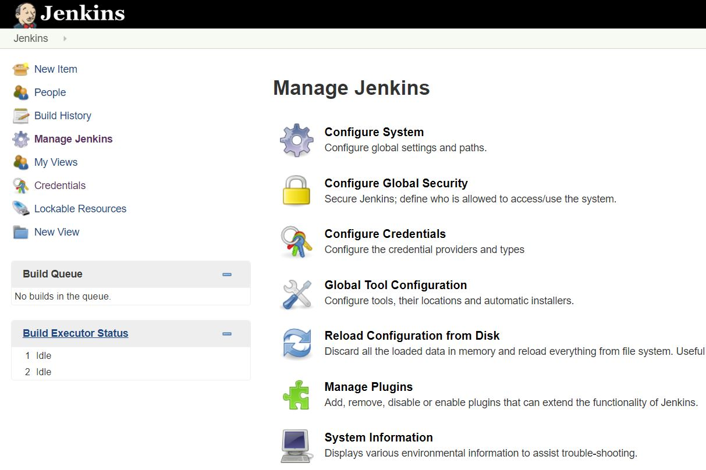

### Configuring Global Environment Variables
##### Requirements for configuration:
* A machine with a Jenkins server installed on it
* The Jenkins server must already have an admin account setup

##### Steps:
**1**. Login to Jenkins server with our admin account

**2**. Click the **Manage Jenkins** link on the Jenkins menu on the left

**3**. Click the **Configure System** link at the top of the page

**4**. On the Configuration Page, scroll down to the *Global properties* section, and enable *Environment variables*

**5**. Go ahead and click **Add**

**6**. Fill in our environment variable information, Click Add for more spaces to fill in environment variables

  * The *Name* field is how we will call the value in the pipeline,
  if the value is `SCORE` then in our code we use `$SCORE`
  * The *Value* field is the value of the environment variable

**7**. Click **Save**, our Environment Variable configurations will be saved

