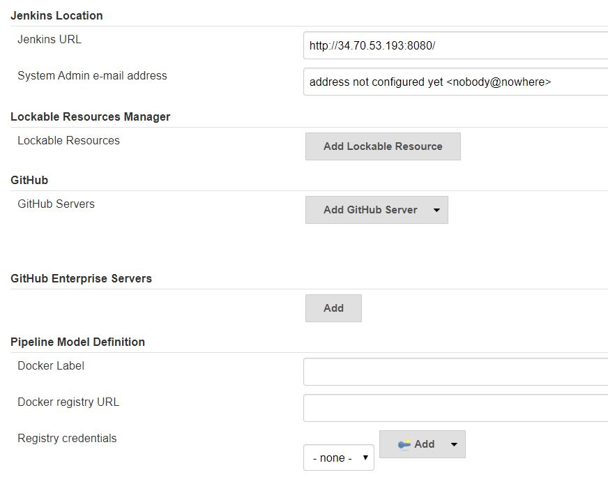
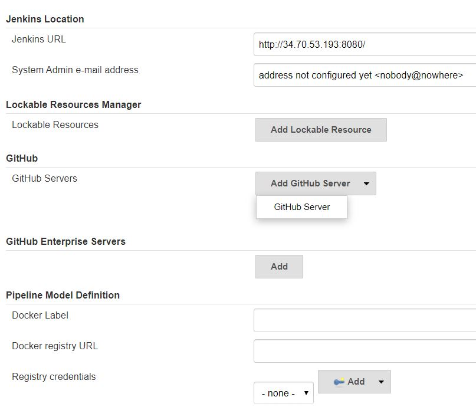
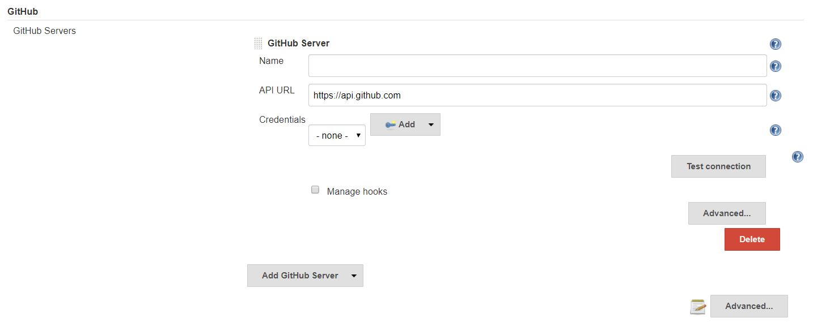

### Configuring Jenkins for a Github Repository
##### Requirements for configuration:
* A machine with a Jenkins server installed on it
* The Jenkins server must already have an admin account setup
* A secret text credential containing a personal access token connected to an account with access to the Github repository.
  * This credential should be given *repo:status*, *repo:public_repo, *repo:repo_deployment*, and *admin:repo_hook*

##### Steps:
**1**. Login to Jenkins server with our admin account

**2**. Click the **Manage Jenkins** link on the Jenkins menu on the left

**3**. Click the **Configure System** link at the top of the page

**4**. On the Configuration Page, scroll down to the *GitHub* section

**5**. In the *GitHub* section, click **Add GitHub Server** and from the dropdown select **GitHub Server**

**6**. The section will expand and we can now add our Github Server details, go ahead and fill in a name for the server, we can leave the api url the same, select the access token credential, and then test our connection to make sure we have access. If so enable **Manage Hooks** so Jenkins can automatically set up web hooks.

**7**. Click **Save**, our Github configurations will be saved

