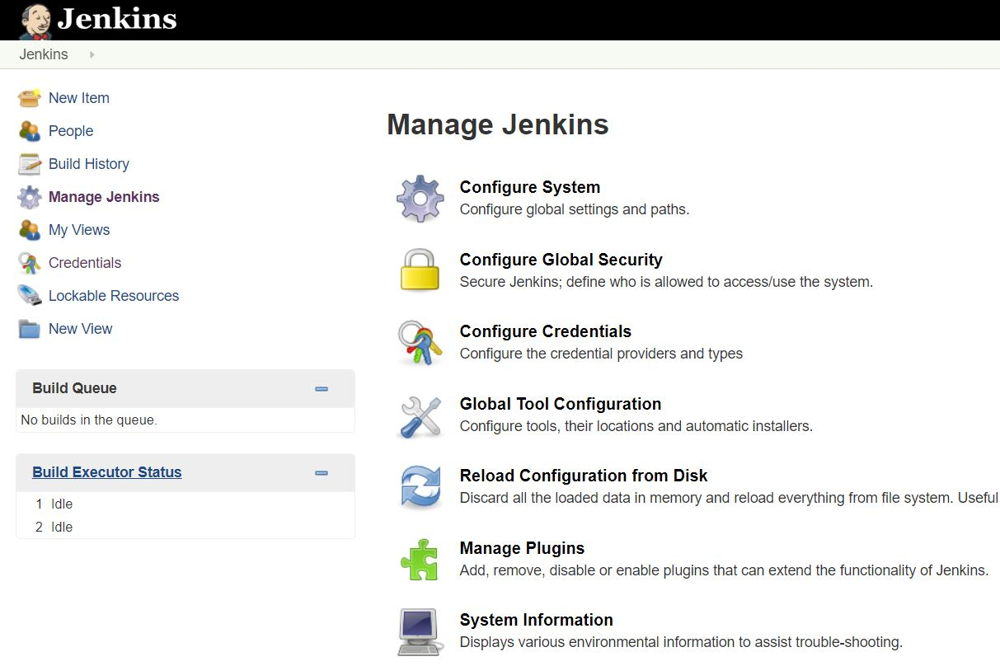
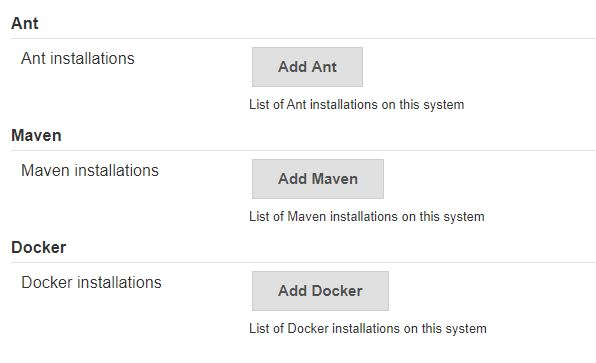
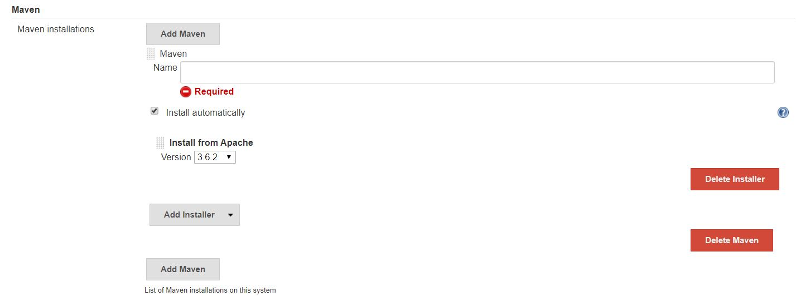

### Configuring Jenkins for a Github Repository
##### Requirements for configuration:
* A machine with a Jenkins server installed on it
* The Jenkins server must already have an admin account setup

##### Steps:
**1**. Login to Jenkins server with our admin account

**2**. Click the **Manage Jenkins** link on the Jenkins menu on the left

**3**. Click the **Global Tool Configuration** link, it should be 4th from the top

**4**. On the Configuration Page, scroll down to the *Maven* section and click **Add Maven**

**5**. Go ahead and give our installation a name, we can let Jenkins install it for us automatically, and select the version to install from Apache

**6**. Click **Save**, Maven will be installed and everything is ready

