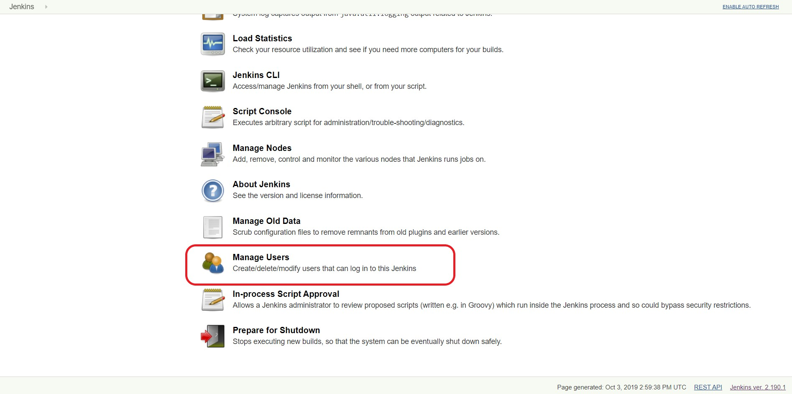

### Creating a User in the Jenkins server
##### Requirements for creating a new user:
* A machine with a Jenkins server installed on it
* The Jenkins server must already have an admin account setup
* User info
  * username
  * password
  * full name
  * email address

##### Steps:
**1**. Login to Jenkins server with admin account

**2**. Click the **Manage Jenkins** link on the Jenkins menu on the left

**3**. Click the **Manage Users** link at the bottom of the page

**4**. Select the **Create User** link on the menu on the left

**5**. Input User info and create our new User

**6**. You are now able to login with the new User Account

