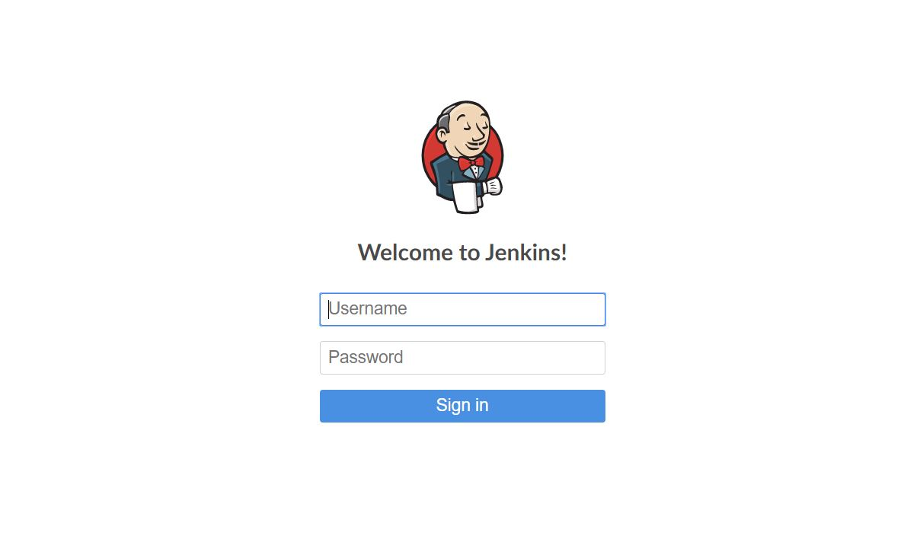
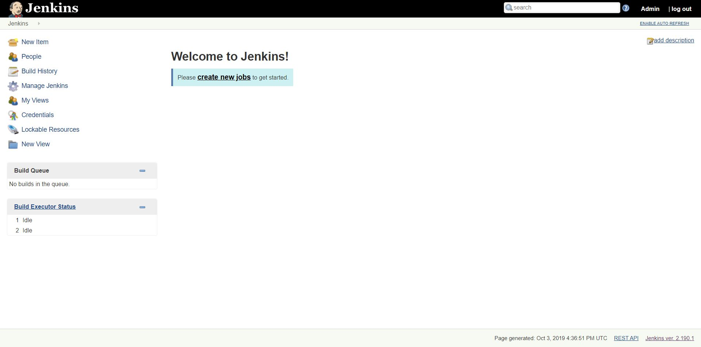
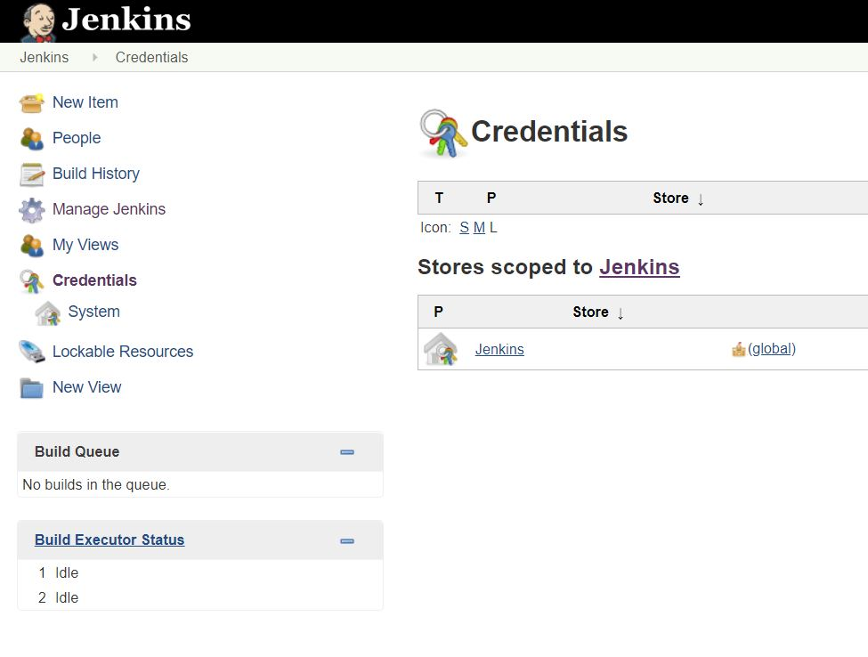
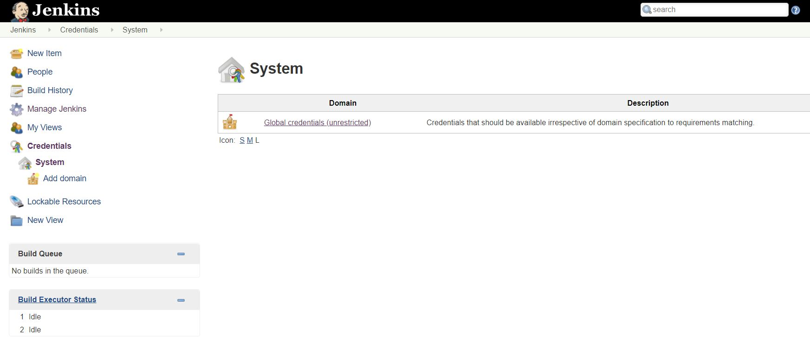
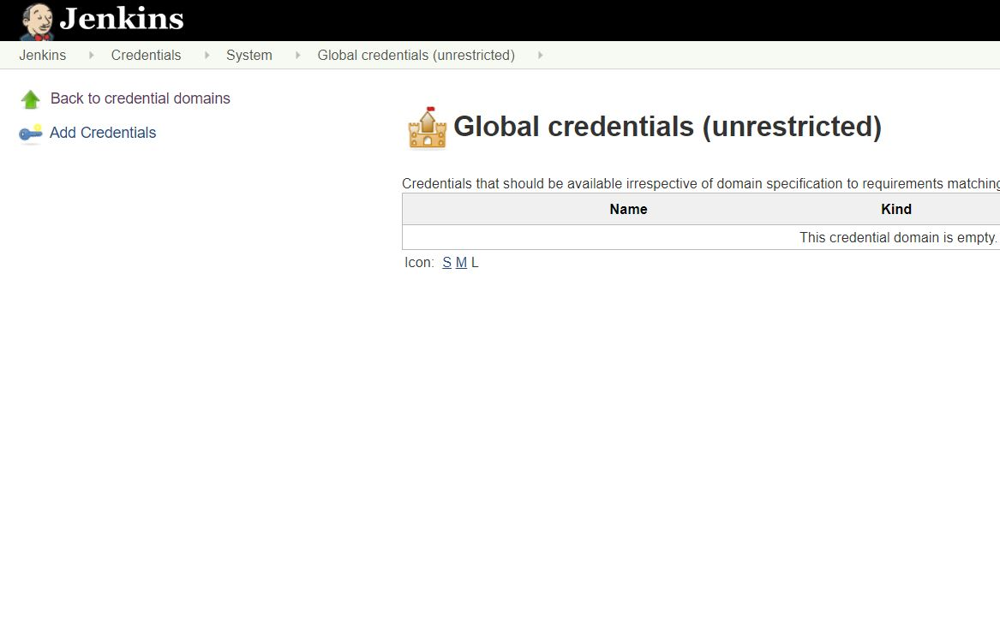
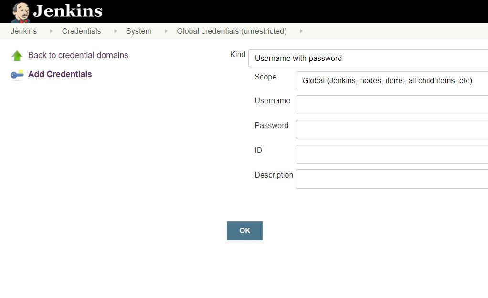

### Setting up Credentials in Jenkins
##### Requirements for configuration:
* A machine with a Jenkins server installed on it
* The Jenkins server must already have an admin account setup

##### Steps:
**1**. Login to Jenkins server with our admin account

**2**. Go to **Credentials** in the menu on the left hand side of the screen

**3**. Go to the sublink **System** underneath **Credentials**

**4**. Go to the domain *Global credentials*

**5**. Select **Add Credentials** from the menu on the left

**6**. On this page, we can create various types of credentials to meet our pipeline needs. Once we have filled out our info click **OK** and the credential will be created

  * Keep in mind that the id is what we will use to identify credentials in builds.
  * This is also how we set up credentials for things such as Github.
  * Credentials can be things such as secret access tokens with secret text credentials or in the form of json files with secret file credentials.

