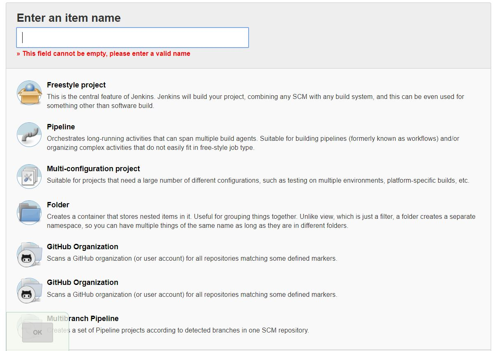
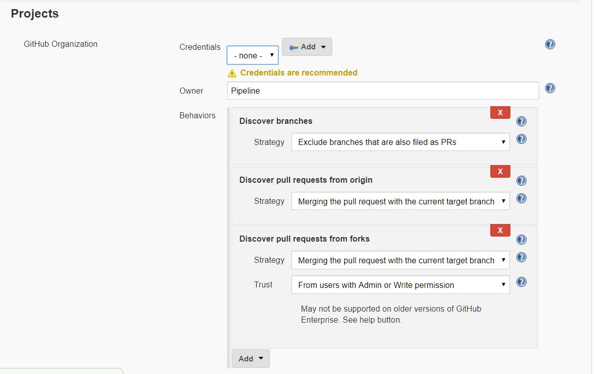
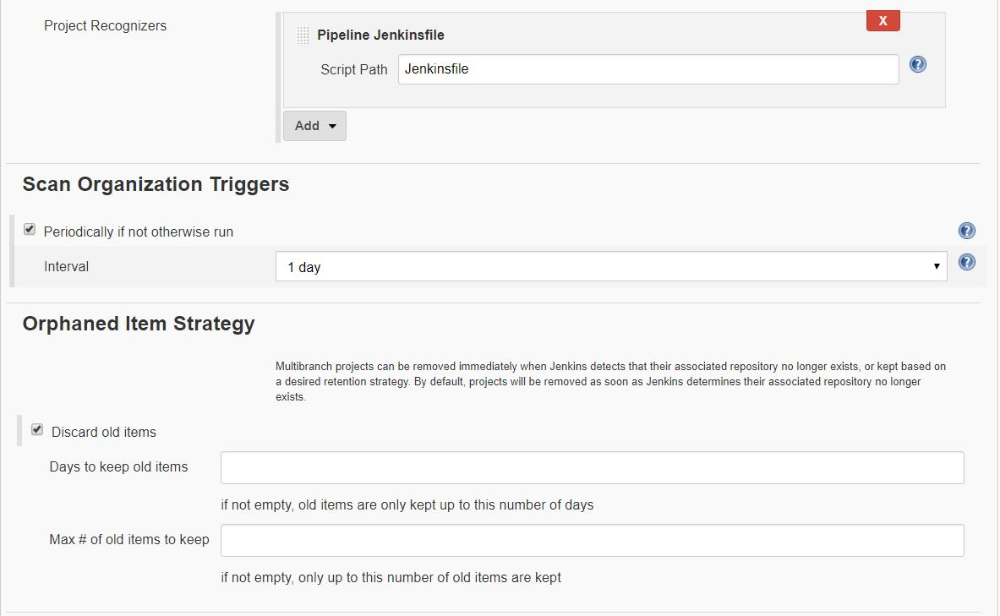

### Configuring Jenkins for a Github Repository
##### Requirements for configuration:
* A machine with a Jenkins server installed on it
* The Jenkins server must already have an admin account setup
* A username and password credential for Github

##### Steps:
**1**. Login to Jenkins server with our admin account

**2**. Create a new job. If we have no jobs set up we can just click the **create new jobs**, but if we have jobs in place we will have to click the **New Item** link in the menu on the left

**3**. Go ahead and fill in the name of our job, select GitHub Organization, and click OK to start configuring our Github pipeline

**4**. We are now in a job configuration page and there are a few things we need to do.
  1. Use our Github credential to interact with the repository.
  2. Fill in the Owner of the repository whether that is a specific user or an organization
  3. Go ahead and delete all the current behaviors so we can add our new behaviors. You can delete behaviors with the **X** button, and you can add new behaviors with the **Add** dropdown.
    1. Create a *Filter by name (with regular expression)* behavior and fill in the *regular expression* field with the name of the repository we want a pipeline to
    2. Create a *Discover branches* behavior and change the *strategy* to *Exclude branches that are also filed as PRs*
    3. Create a *Discover pull requests from origin* behavior and change the *strategy* to *The current pull request revision*
    4. Create a *Wipe out repository & force clone* behavior

  4. Change our *Pipeline Jenkinsfile Script Path* to whatever path is necessary to reach our Jenkinsfile

  5. At this point, we can go ahead and save our job, it will run a scan, and run any builds that it needs to.

