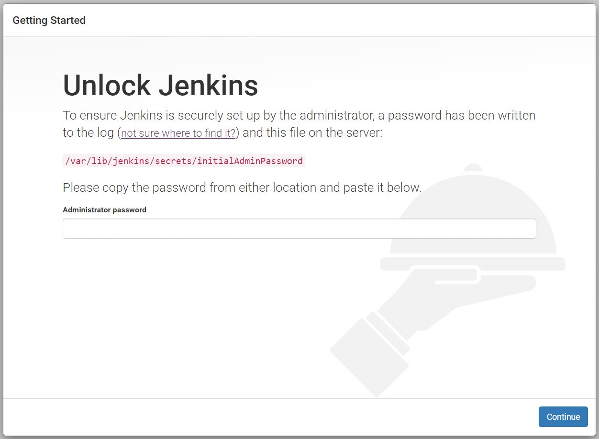
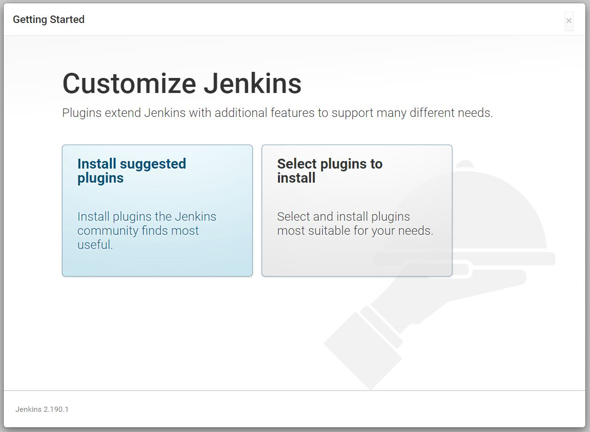
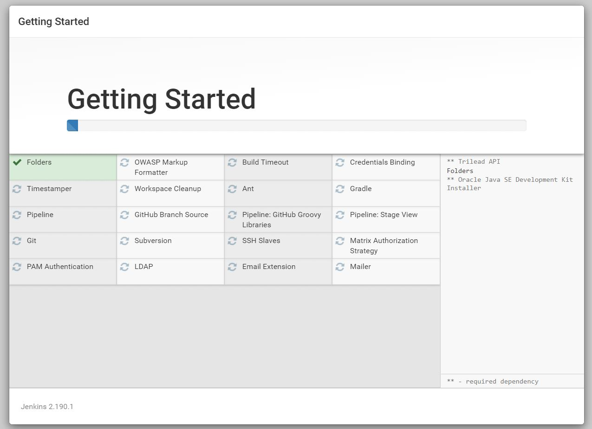
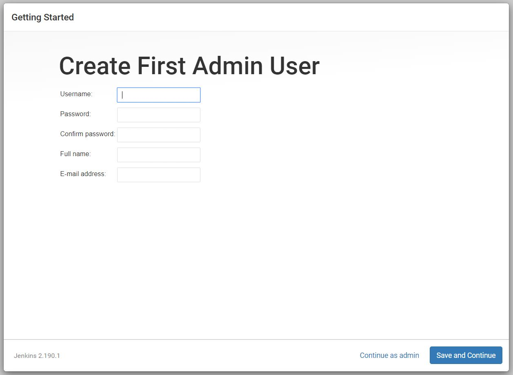
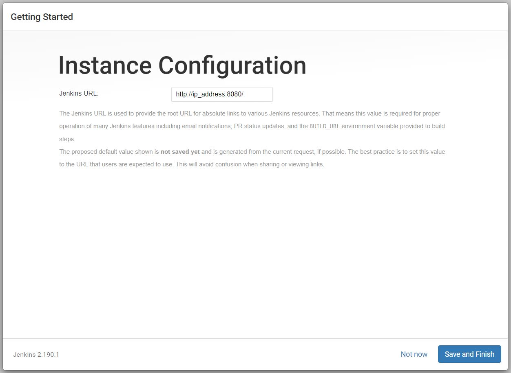
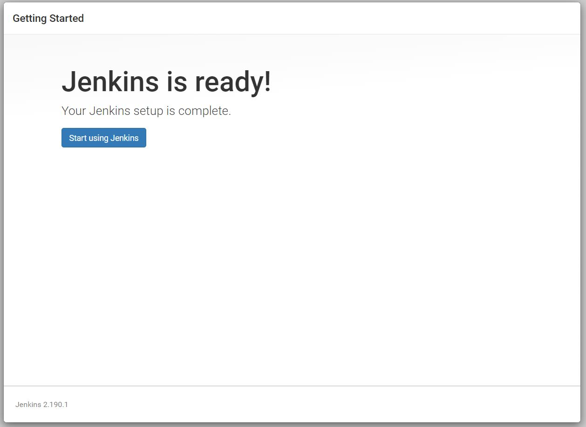

### Initial Jenkins server setup
##### Requirements for these instructions:
* A machine with a Jenkins server installed on it
* An external ip address for the machine running Jenkins
* Ability to access port 8080 on the machine (this is the port to access Jenkins)
* SSH access to machine running Jenkins whether that is through a bastion or directly
* Account on Jenkins machine with sudo privileges
* Admin User info
  * username
  * password
  * full name
  * email address

##### Steps:
**1**. SSH into Jenkins machine and run command `sudo cat /var/lib/jenkins/secrets/initialAdminPassword`

**2**. Copy the output of the previous command to our clipboard

  * This is our initial administrator password.

**3**. Connect to Jenkins server using your browser. ip-address:8080

**4**. Copy the command output into the **Administrator password** field and click continue

  * After a few moments, we will arrive at a **Customize Jenkins** Page

**5**. At this page we can select which additional plugins we want Jenkins to come with after initial setup. We can go ahead and **Install suggested plugins**.

  * The machine will spend a few seconds installing the plugins before we can move on to create our first Admin User

**6**. We are now able to create our first admin user. Input our user info and then go ahead and press **Save and Continue**.

**7**. Now we arrive at a page where we can configure our Jenkins URL. We can go ahead and leave it as its default value which is an http to our ip address on port 8080, and click **Save and Finish**.

**8**. Our initial Jenkins setup is now complete go ahead and click **Start using Jenkins**.

  * We will arrive at the Jenkins Dashboard

